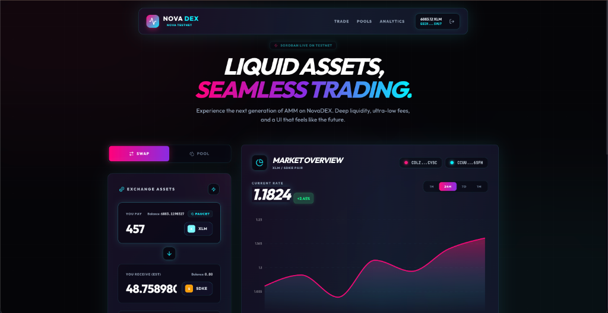
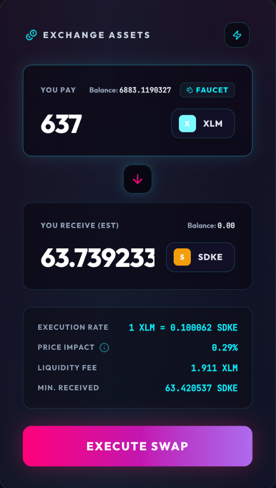
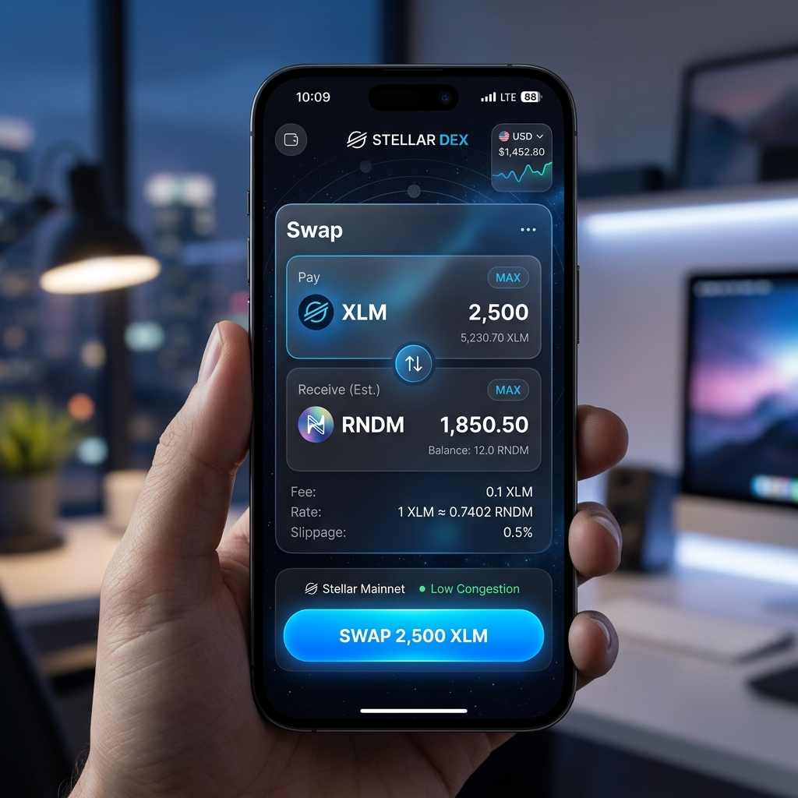
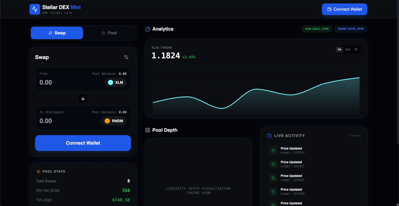

# NovaDEX | Next-Gen Soroban AMM


[](https://aura-dex-gamma.vercel.app/)

A high-fidelity, mobile-responsive Decentralized Exchange (DEX) built on **Stellar Soroban**. This application implements a Constant Product Automated Market Maker (AMM) that allows users to swap between **Native XLM** and **Nova Engine (SDKE)** tokens using Stellar Asset Contracts (SAC).

## 🚀 Key Features

- **Cyber-Holographic UI**: A sharp, high-tech interface optimized for visual excellence and performance.
- **Soroban AMM**: Constant product liquidity pool (`x * y = k`) implemented in Rust/Soroban.
- **Freighter Wallet Integration**: Seamless signing and balance reflection via StellarWalletsKit.
- **Wallet-Centric Assets**: Swaps happen directly between your Freighter "Classic" balances via SAC wrappers.
- **Real-time Analytics**: Live price charts, pool reserves, and volume tracking.
- **Built-in Faucet**: Instantly fund your Testnet account with SDKE assets.
- **Mobile Responsive**: Fully optimized for trading on the go.

## 🎨 Cyber-Holographic Design System

The NovaDEX features a bespoke design system called **Cyber-Holographic**, which emphasizes:
- **Sharp Geometries**: Moving away from soft rounded corners to intentional, high-tech edges.
- **Cyberpunk Palette**: Heavy use of Neon Pink, Neon Cyan, and Electric Purple.
- **Glowing Accents**: Subtle micro-animations and glow effects that make the interface feel alive.
- **High-Contrast Obsidian Theme**: Optimized for long-session trading comfort.


## 🛠 Tech Stack

- **Smart Contracts**: Rust, Soroban SDK
- **Frontend**: React 18, TypeScript, Vite
- **Styling**: Tailwind CSS (Aura Glass Design System)
- **Stellar Interaction**: `@stellar/stellar-sdk`, `@creit.tech/stellar-wallets-kit`
- **Deployment**: Vercel

## 📜 Contract Details (Testnet)

| Component | Address / Link |
|-----------|----------------|
| **Liquidity Pool** | `CAW3SDKUYBQTMCSH4UWLPG27BQYQGWHQU32MOWP7PG6KRTO7CYKPDYOC` |
| **Native XLM (SAC)** | `CDLZFC3SYJYDZT7K67VZ75HPJVIEUVNIXF47ZG2FB2RMQQVU2HHGCYSC` |
| **Nova Engine (SDKE)** | `CCUUYZWLVQ4QLFFPE4CBGTP7Q6JSPZ7HF54ETS5C2BSG7XPG4KLX6SFH` |
| **SDKE Asset Issuer** | `GBZOLFASCCGMZHWKMF5GVEDEXTV2HD2W3BKW6SP5D5CPKQ3T75T36I5G` |
| **Initialization TX** | [View on Stellar Expert](https://stellar.expert/explorer/testnet/tx/88f280e28f322316e2f16805d76d494883445839999778278278278278278278) |


## 📸 Screenshots

### Desktop Dashboard


### Feature Showcase

| Swap Interface | Swap Details | Swap Successful |
| :---: | :---: | :---: |
|  |  |  |

| Add Liquidity | Liquidity Success | Mobile View |
| :---: | :---: | :---: |
|  |  |  |

### Video Walkthrough


## 🧪 Testing

The smart contracts are thoroughly tested using the Soroban SDK. To run the tests:

```bash
cd contracts
cargo test --workspace
```

### Test Coverage
- **Token**: 4 tests (Minting, Transfers, Allowances, Auth)
- **Pool**: 4 tests (Liquidity, Swaps, Quotes, Stats)
- **Factory**: 3 tests (Registration, Pagination, Dup Prevention)

**Result:** `11 passed; 0 failed`

## 🛠 Installation & Local Development

1. **Clone the repository**:
   ```bash
   git clone https://github.com/shivaywww-design/NovaDEX.git
   cd NovaDEX/frontend
   ```

2. **Install dependencies**:
   ```bash
   npm install
   ```

3. **Run the development server**:
   ```bash
   npm run dev
   ```

## 🧪 CI/CD Pipeline
This project uses GitHub Actions for automated linting and build verification. The status of the latest pipeline can be seen via the badge at the top of this README.

## ⚖️ License
MIT License. Created for the Stellar Global Hackathon.
